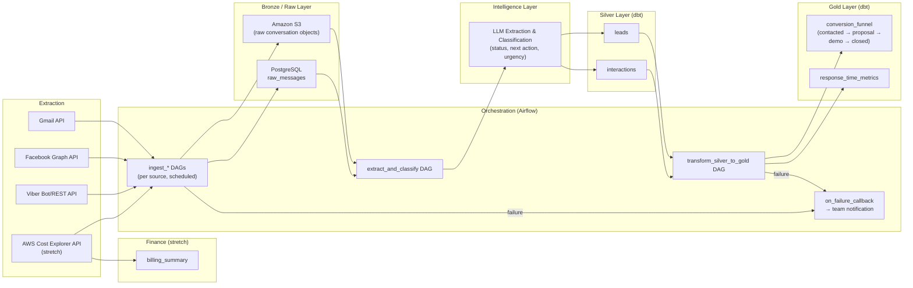

# SolNexus

SolNexus is a unified lead and client communication pipeline for SolTech EMR. It brings lead conversations from email, Facebook Messenger, and Viber into one searchable system, helping the team track follow-ups and client history without relying on a manually maintained spreadsheet.

## Project Goals

- Centralize lead and interaction data from multiple communication channels.
- Show which leads need follow-up today.
- Provide a searchable history of all leads and conversations.
- Automate ingestion, transformation, and pipeline monitoring.
- Support future analytics and AI-assisted lead classification.

## Planned Phases

### Phase 1: MVP

- Gmail API ingestion, with manual imports for Facebook and Viber exports.
- PostgreSQL bronze storage and dbt silver models for leads and interactions.
- Airflow orchestration with retries.
- FastAPI backend and React dashboard.
- Authentication for SolTech staff.

### Phase 2: Expansion

- Automated Facebook Messenger and Viber integrations.
- LLM-based extraction of lead status, next actions, and urgency.
- Amazon S3 raw data lake and dbt gold analytics models.
- Conversion funnel and response-time reporting.
- Pipeline failure alerts and optional finance tracking and daily digest features.

## Architecture

The system follows a bronze/silver/gold data architecture:

The dashboard provides two core views: **Leads to Follow Up Today** and **All Leads**.

## Technology Stack

- **Backend:** FastAPI and Python
- **Frontend:** React
- **Data:** PostgreSQL, dbt, and Amazon S3 (Phase 2)
- **Pipeline:** Apache Airflow
- **Integrations:** Gmail API, Facebook Graph API, Viber API, and AWS Cost Explorer

## Documentation

- [Project Proposal](docs/project_proposal.md)
- [Software Requirements](docs/software_requirements.md)
- [System Architecture](docs/architecture.md)
