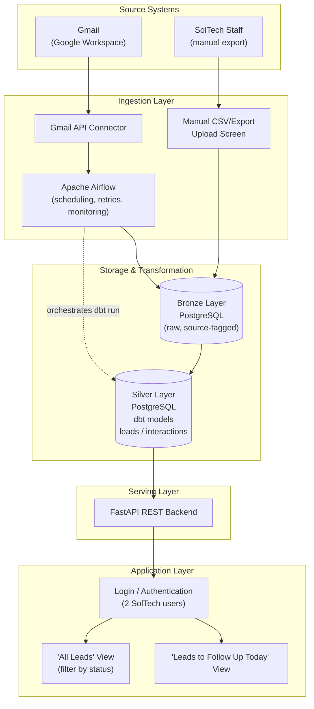
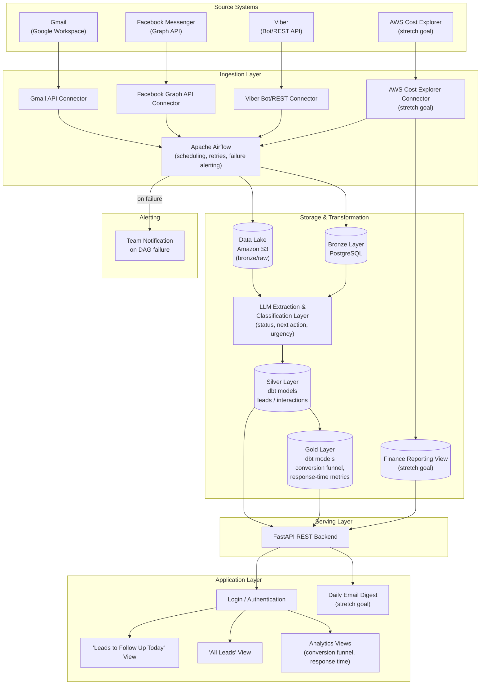
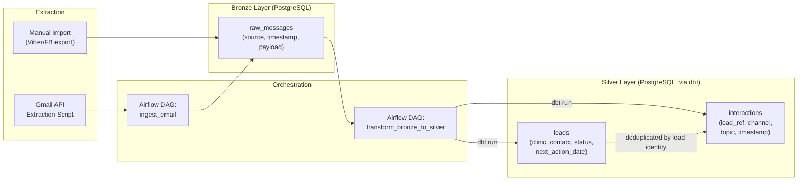
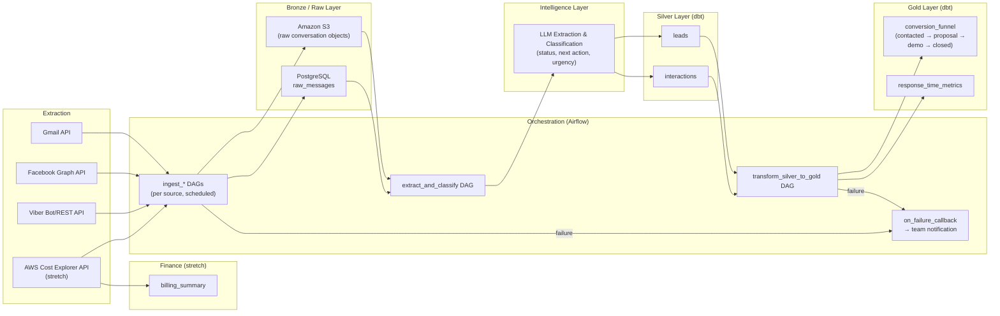

# System Architecture

## Unified Lead & Client Communication Intelligence Pipeline
**SolTech EMR | CMSC 128 / CMSC 129 (SWE 1 & SWE 2)**

This document describes the architecture of the system in two parts:

1. **Overall System Architecture** — the end-to-end view, from source systems through to the dashboard used by SolTech staff.
2. **Data Pipeline Architecture** — a focused view of the ingestion → storage → transformation flow that powers the dashboard, including the bronze/silver/gold layering and orchestration.

Architecture is presented for both **Phase 1 (Semester 1 / SWE 1)** and **Phase 2 (Semester 2 / SWE 2)**, consistent with the phased scope in the project proposal and requirements list.

---

## 1. Overall System Architecture

### 1.1 Description

The system is organized into five layers:

- **Source Systems** — the external platforms where lead conversations originate (Gmail, Facebook Messenger, Viber), plus AWS billing data for the stretch-goal finance module.
- **Ingestion Layer** — Python connectors that pull data from source systems, scheduled and orchestrated by Apache Airflow. In Phase 1, Facebook and Viber data enters via manual staff upload rather than a live API connection (FR-02).
- **Storage & Transformation Layer** — the bronze/silver/gold medallion architecture: raw storage, normalized structured tables, and (in Phase 2) aggregated analytics tables.
- **Serving Layer** — a FastAPI REST backend that exposes leads, interactions, and analytics data.
- **Application Layer** — the React dashboard used by SolTech's two authenticated team members, plus optional Phase 2 notification output (daily digest email).

Authentication (FR-10) gates access to the dashboard and, transitively, to the API layer, satisfying the access-control requirement (NFR-03) given the sensitivity of clinic client data.

### 1.2 Diagram — Phase 1 (Semester 1 / SWE 1)

### 1.3 Diagram — Phase 2 (Semester 2 / SWE 2)

Phase 2 replaces manual import with live API ingestion for Facebook and Viber, introduces an LLM extraction step, adds S3 as a raw data lake, adds a gold analytics layer, and adds alerting and an optional digest notification.

### 1.4 Component Notes

| Component | Responsibility | Requirement(s) |
|---|---|---|
| Gmail API Connector | Automated ingestion of lead email threads | FR-01 |
| Manual Upload Screen | Staff-driven import of Viber/Facebook exports (Phase 1 only) | FR-02 |
| Facebook Graph API / Viber Bot API Connectors | Automated ingestion, replacing manual import | FR-11, FR-12 |
| Apache Airflow | Scheduling, retries, and (Phase 2) failure alerting | FR-05, FR-18, NFR-02, NFR-08 |
| PostgreSQL Bronze Layer | Immutable raw storage tagged by source/timestamp | FR-03, NFR-09 |
| Amazon S3 | Scalable raw data lake for unstructured conversation data | FR-14 |
| LLM Extraction Layer | Converts unstructured chat text into structured fields (status, next action, urgency) | FR-13 |
| dbt Silver Models | Normalized `leads` / `interactions` tables, deduplicated across channels | FR-04, NFR-01, NFR-06 |
| dbt Gold Models | Conversion funnel and response-time analytics | FR-15 |
| FastAPI Backend | REST API serving leads/interactions/analytics to the frontend | FR-06 |
| React Dashboard | Two-table lead view (Phase 1) plus analytics views (Phase 2) | FR-07, FR-08, FR-09 |
| Authentication | Login restricted to the two SolTech team members | FR-10, NFR-03 |
| Finance Reporting View | AWS billing (and optional manual entries) reporting | FR-16 (stretch) |
| Daily Digest Notification | Emailed summary of due follow-ups | FR-17 (stretch) |

---

## 2. Data Pipeline Architecture

This section zooms into the ingestion → storage → transformation flow — the medallion (bronze/silver/gold) pipeline referenced in Section 6 of the proposal — independent of the frontend/serving concerns covered above.

### 2.1 Description

The pipeline is orchestrated end-to-end by Apache Airflow, which triggers extraction jobs, bronze writes, dbt transformation runs, and (Phase 2) alerts on failure. Each layer has a distinct responsibility:

- **Bronze** — raw, untransformed data, tagged with source channel and ingestion timestamp, preserved for traceability (NFR-09) and retained even if downstream transformation logic changes.
- **Silver** — cleaned, deduplicated, and normalized `leads` and `interactions` tables, produced by modular dbt models (NFR-01, NFR-06). In Phase 2, an LLM extraction step sits between bronze and silver to convert unstructured message text into structured fields (status, next action, urgency/sentiment) before the dbt models consume it.
- **Gold** (Phase 2 only) — aggregated analytics: the lead conversion funnel and response-time metrics.

### 2.2 Diagram — Phase 1 Data Flow

### 2.3 Diagram — Phase 2 Data Flow

### 2.4 Layer Responsibilities Summary

| Layer | Phase 1 | Phase 2 |
|---|---|---|
| Extraction | Gmail API + manual export upload | Gmail, Facebook Graph, Viber, (AWS Cost Explorer) APIs — fully automated |
| Orchestration | Airflow DAGs with retries | Airflow DAGs with retries + failure alerting |
| Bronze / Raw | PostgreSQL, source + timestamp tagged | PostgreSQL + Amazon S3 (data lake) |
| Intelligence | Rule-based status parsing (baseline) | LLM-based extraction & classification |
| Silver | dbt models: `leads`, `interactions` | dbt models: `leads`, `interactions` (fed by LLM output) |
| Gold | — | dbt models: conversion funnel, response-time metrics |
| Finance (stretch) | — | Billing summary view from AWS Cost Explorer |

### 2.5 Cross-Cutting Pipeline Properties

- **Deduplication (NFR-01):** the silver-layer dbt models are responsible for resolving the same lead appearing across multiple channels into a single `leads` record, linked to many `interactions` rows rather than fragmenting history by source.
- **Traceability (NFR-09):** every bronze-layer record retains its originating channel and ingestion timestamp, so any `leads`/`interactions` row can be traced back to its raw source.
- **Reliability & Observability (NFR-02, NFR-08):** Airflow provides retries on failure in Phase 1 and adds failure alerting in Phase 2, so pipeline health is visible to the team rather than failing silently.
- **Scalability of source integration (NFR-07):** because each source lands in the same bronze schema (source channel + timestamp + raw payload) before transformation, adding a new channel means adding a new extractor and Airflow DAG, not redesigning the silver/gold data model.

---

*This architecture document is derived from the SolTech EMR project proposal and software requirements list (September 18, 2026) and reflects the phased Semester 1 / Semester 2 scope defined therein.*